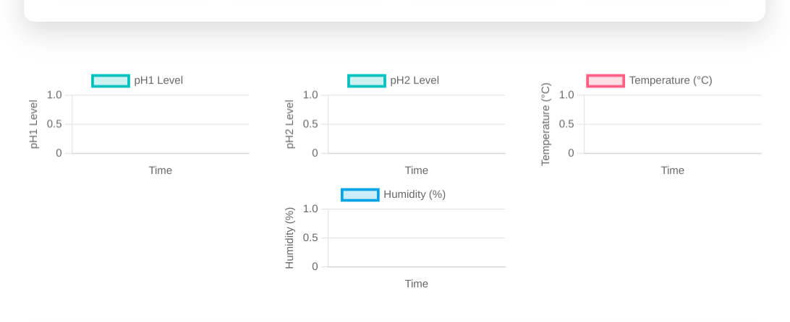
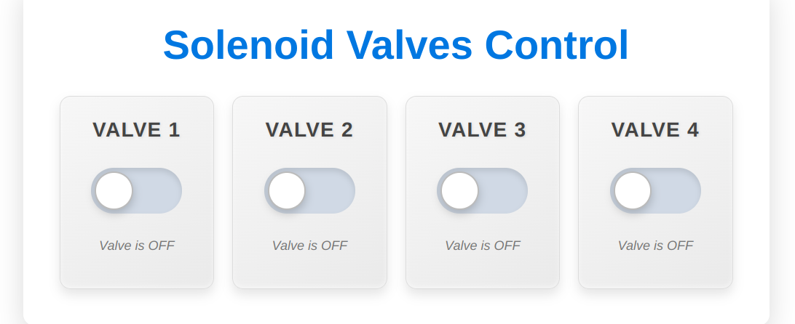
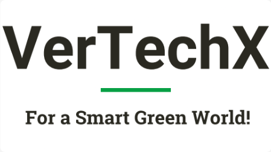
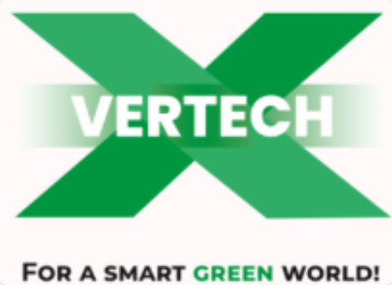

# VertechX 3.0 - Vertical Farming System Prototype 🌱


## 🚀 Project Overview

VertechX 3.0 is a **prototype** web application designed to control and monitor a vertical farming system using hydroponics technology. This project serves as a proof of concept and is not intended for production use.

### ⚠️ Prototype Disclaimer
This is a **prototype implementation** meant for demonstration and testing purposes only. It should not be used in actual vertical farming operations without substantial modifications and real-world testing.

## 🌟 Key Features

### 👤 User Management
- User registration and authentication
- Profile management
- Account deletion
- Secure password handling

### 🎛️ Control System
- **Dual Operation Modes**:
  - Manual Control
  - Automatic Control with scheduling
- **Hardware Control**:
  - Water Pumps
  - Solenoid Valves
  - LED Grow Lights
- **Sensor Monitoring**:
  - Temperature
  - Humidity
  - pH Levels

### 🤖 Automatic Mode
- Scheduled operations
- Email notifications
- Automated control based on sensor readings
- System status monitoring

### 📊 Real-time Dashboard


### 📱 Control Interface


## 💻 Technology Stack

- **Backend**:
  - Flask (Web Application)
  - FastAPI (Hardware Control API)
  - SQLite Database
  - SQLAlchemy ORM
- **Frontend**:
  - HTML5
  - CSS3
  - JavaScript
  - Bootstrap 5
- **Authentication**: Flask-Login
- **Email**: SMTP Integration

## 🛠️ Project Structure

```
VertechX/
├── VertechX/
│   ├── __init__.py
│   ├── models.py      # Database models
│   ├── routes.py      # Web routes
│   ├── forms.py       # Form handling
│   ├── automatic.py   # Automatic mode logic
│   └── fastapiapp.py  # Hardware control API
├── Templates/         # HTML templates
├── static/           # Static files
├── instance/         # Instance configuration
├── requirements.txt  # Dependencies
└── run.py           # Application entry point
```

## 📸 Interface Screenshots

### System Monitoring


### Control Panel


## 🚀 Setup Instructions

1. Create and activate virtual environment:
   ```bash
   python3 -m venv venv
   source venv/bin/activate  # Linux/Mac
   ```

2. Install dependencies:
   ```bash
   python3 -m pip install -r requirements.txt
   ```

3. Run the application:
   ```bash
   python3 run.py
   ```

## 🔧 Configuration

The application uses environment variables for configuration. Create a `.env` file with:

```env
FLASK_APP=run.py
FLASK_ENV=development
SECRET_KEY=your_secret_key
EMAIL_USER=your_email@gmail.com
EMAIL_PASS=your_email_password
```

## 🛡️ Security Features

- User Authentication
- Password Hashing
- CSRF Protection
- Session Management

## 📝 Note

This prototype demonstrates the potential of automated vertical farming systems. For production use, significant modifications would be needed, including:

- Real hardware integration
- Production-grade database
- Enhanced security measures
- Thorough testing
- Proper deployment configuration

## 📄 License

This project is licensed under the MIT License - see the LICENSE file for details.

---

⚠️ Remember: This is a prototype implementation and should not be used in production without proper modifications and testing.

   
