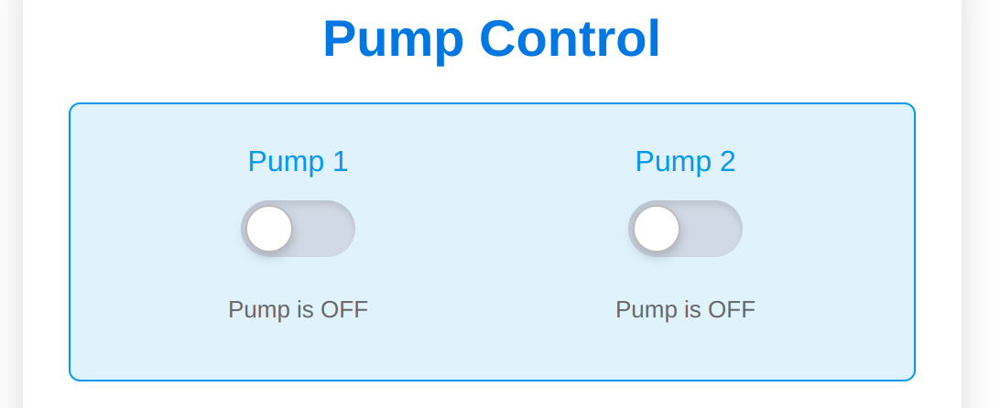
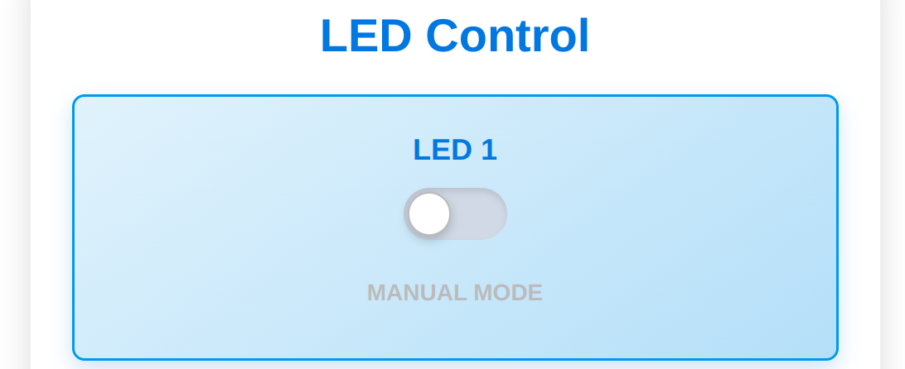
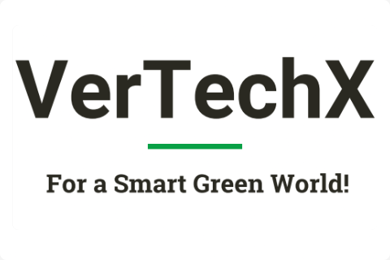
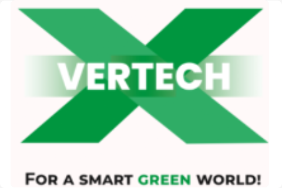

# VertechX 3.0 - Vertical Farming System Prototype 🌱


## 🚀 Project Overview

VertechX 3.0 is a **prototype** web application designed to demonstrate the potential of automated vertical farming systems using hydroponics technology. This project serves as a proof of concept and is not intended for production use.

### ⚠️ Prototype Disclaimer
This is a **prototype implementation** meant for demonstration and testing purposes only. It should not be used in actual vertical farming operations without substantial modifications and real-world testing.

## 🌟 Key Features

- 🎛️ **Smart Control System**: Simulated monitoring and control of:
  - Temperature
  - Humidity
  - pH levels
  - Nutrient levels
  - LED grow lights
  - Water pumps

- 📊 **Real-time Dashboard**
  

- 🔐 **User Authentication System**
  

- 📱 **Responsive Design**
  

- 🎯 **Sensor Integration** (Simulated)
  

## 💻 Technology Stack

- **Backend**: Flask + FastAPI
- **Frontend**: HTML5, CSS3, JavaScript, Bootstrap 5
- **Database**: SQLite (Development)
- **Authentication**: Flask-Login
- **Additional Features**:
  - Dark Mode Support
  - Rate Limiting
  - Error Handling
  - Security Features

## 🛠️ Project Structure

```
VertechX/
├── VertechX/
│   ├── __init__.py
│   ├── models.py
│   ├── routes.py
│   └── utils.py
├── Templates/
│   ├── base.html
│   ├── dashboard.html
│   └── errors/
├── static/
│   ├── css/
│   ├── js/
│   └── images/
├── instance/
├── requirements.txt
└── run.py
```

## 📸 Interface Screenshots

### System Monitoring


### Control Panel


### Data Analytics


### Mobile View


## 🚀 Setup Instructions

1. Create and activate virtual environment:
   ```bash
   python3 -m venv venv
   source venv/bin/activate  # Linux/Mac
   ```

2. Install dependencies:
   ```bash
   python3 -m pip install -r requirements.txt
   ```

3. Run the application:
   ```bash
   python3 run.py
   ```

## 🔧 Configuration

The application uses environment variables for configuration. Create a `.env` file with:

```env
FLASK_APP=run.py
FLASK_ENV=development
SECRET_KEY=your_secret_key
```

## 🛡️ Security Features

- CSRF Protection
- Rate Limiting
- Secure Password Hashing
- XSS Prevention
- SQL Injection Protection

## 📱 Responsive Design

The application is fully responsive and works on:
- 💻 Desktop
- 📱 Mobile
- 📟 Tablets

## 🌙 Dark Mode

Built-in dark mode support for better visibility in low-light conditions.

## ⚠️ Error Handling

Custom error pages for common HTTP errors:
- 400 Bad Request
- 404 Not Found
- 500 Internal Server Error

## 🔄 Future Improvements

1. Integration with real sensors and hardware
2. Advanced analytics and reporting
3. Mobile application development
4. Machine learning for growth optimization
5. Extended monitoring capabilities

## 📝 Note

This prototype demonstrates the potential of automated vertical farming systems. For production use, significant modifications would be needed, including:

- Real hardware integration
- Production-grade database
- Enhanced security measures
- Thorough testing
- Proper deployment configuration

## 📄 License

This project is licensed under the MIT License - see the LICENSE file for details.

---

⚠️ Remember: This is a prototype implementation and should not be used in production without proper modifications and testing.

   
